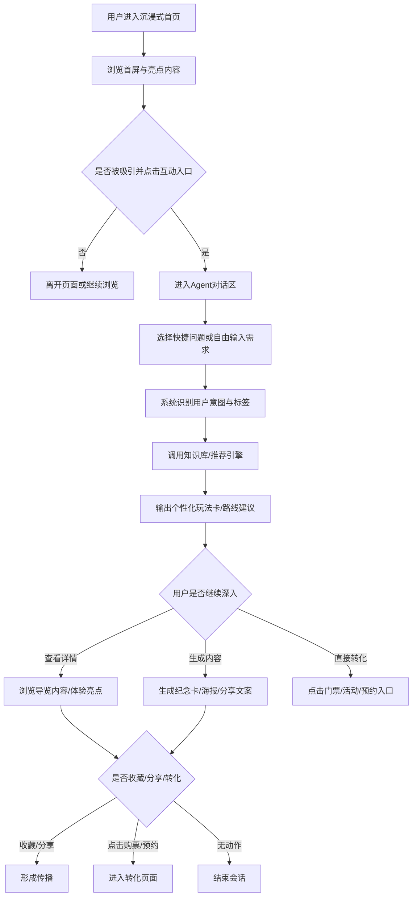
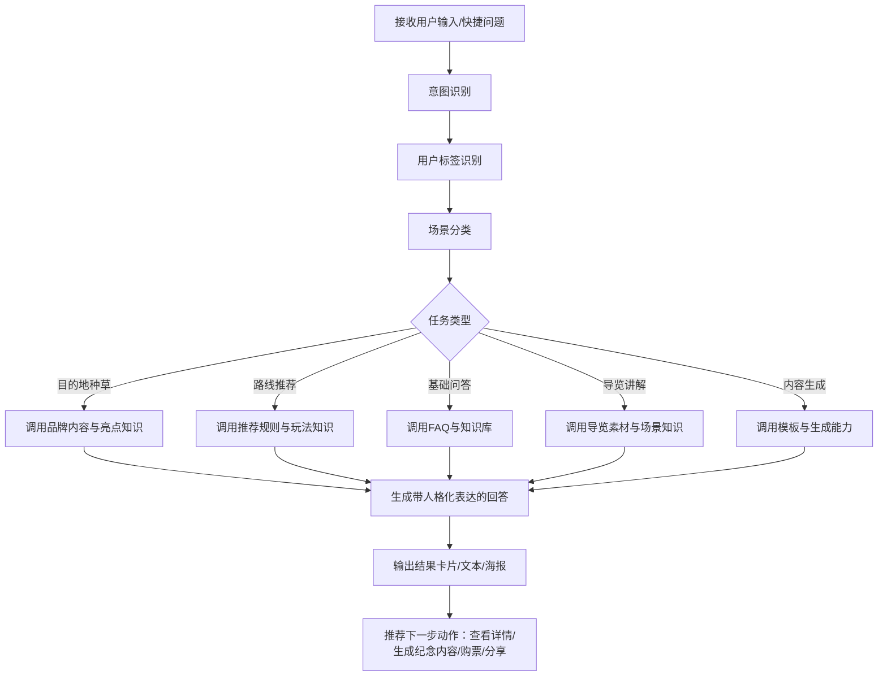

# 《Macau Tower Destination Agent》PRD
**版本**：V1.0  
**产品形态**：沉浸式网页 + 对话式 Agent  
**产品定位**：以“科技感旅游管家”为人格的澳门塔目的地 Agent，集品牌传播、智能推荐、沉浸导览、内容生成与转化承接于一体。  

---

## 1. 需求背景

### 1.1 项目背景
澳门希望持续强化其作为国际旅游城市的吸引力，而澳门塔作为澳门最具辨识度的城市地标之一，天然具备“目的地入口”属性。  
但在传统文旅宣传中，澳门塔更多以“景点介绍页”或“门票购买入口”的形式出现，其数字化表达偏静态，难以同时满足以下目标：

1. **全球传播目标**：让更多海外及年轻游客对澳门塔形成明确记忆点与兴趣；
2. **旅游决策目标**：帮助用户从“知道澳门塔”走向“愿意去澳门塔、安排去澳门塔”；
3. **品牌资产目标**：沉淀澳门塔自己的数字资产库与知识库，形成可复用、可持续运营的内容中台；
4. **科技感与文娱属性目标**：将澳门塔从“被浏览的景点”升级为“可互动、可推荐、可生成内容的数字目的地”。

### 1.2 当前问题
目前用户在了解澳门塔时，通常会遇到以下问题：

- **信息呈现偏静态**：用户只能被动浏览图文，缺少沉浸感与互动感；
- **缺乏个性化推荐**：不同人群（情侣、家庭、首次游客、短暂停留游客）看到的内容相似，无法快速获得“适合我的玩法”；
- **品牌表达不够人格化**：澳门塔作为城市地标未形成鲜明的数字角色与持续互动关系；
- **内容资产分散**：图文、视频、故事、活动、玩法、FAQ 等内容难以结构化沉淀并被智能调用；
- **宣传与转化脱节**：品牌传播、用户互动与门票/活动/路线转化之间缺乏闭环。

### 1.3 需求定义
因此，本需求旨在设计一个以澳门塔为核心 IP 的 **Macau Tower Destination Agent**，通过“沉浸式网页 + 对话式 Agent”的产品形态，完成以下升级：

- 将澳门塔从静态景点升级为“科技感旅游管家”；
- 将品牌展示升级为“种草—互动—推荐—转化—传播”的完整体验闭环；
- 将内容素材沉淀为数字资产库，并结合知识库形成可持续优化的 Agent 能力底座。

---

## 2. 产品目标

### 2.1 产品愿景
让澳门塔从“一个景点”升级为“一个会与游客互动、会推荐玩法、会讲述城市故事、会促进旅游决策的数字地标 Agent”。

### 2.2 核心目标
#### 目标 1：提升目的地吸引力
通过沉浸式视觉和人格化 Agent 表达，让用户对澳门塔形成更强烈的兴趣与记忆点。

#### 目标 2：提升旅游决策效率
通过个性化推荐、导览建议和场景化问答，降低用户决策成本，提升“值得去”“怎么去”“怎么玩”的判断效率。

#### 目标 3：构建品牌内容资产底座
沉淀澳门塔的品牌故事、图片、视频、活动、FAQ、玩法知识等内容，形成数字资产库与知识库，支持长期运营。

#### 目标 4：形成传播与转化闭环
支持门票/活动/路线推荐、纪念内容生成与社交分享，形成宣传、互动、转化与裂变的一体化产品闭环。

### 2.3 阶段性业务目标（MVP）
- 首页访问用户的互动进入率 ≥ 25%
- 进入 Agent 互动后的推荐结果查看率 ≥ 60%
- 推荐结果后的转化点击率 ≥ 15%
- 纪念内容生成或分享率 ≥ 10%
- 首轮问答有效命中率 ≥ 85%

---

## 3. 用户故事

### 3.1 用户角色定义
#### 角色 A：首次来澳门的游客
- 我第一次来澳门，不知道澳门塔是不是必去景点；
- 我希望快速了解澳门塔有什么亮点、适不适合我；
- 我希望有人根据我的时间和偏好，直接给出玩法建议。

#### 角色 B：年轻情侣 / 朋友出游用户
- 我希望找到有氛围感、适合拍照和夜景体验的路线；
- 我不想自己查很多攻略，希望系统直接给我“最适合约会/打卡”的方案；
- 我希望游玩后能生成可分享的纪念内容。

#### 角色 C：家庭游客 / 轻度休闲游客
- 我想知道澳门塔是否适合带老人和孩子一起去；
- 我更关注舒适度、动线和时间安排；
- 我希望系统帮我规划一个轻松、省心的游玩方案。

#### 角色 D：海外游客 / 内容传播用户
- 我希望在较短时间内快速理解澳门塔的独特价值；
- 我希望产品支持自然的多语言表达；
- 我希望内容足够有视觉记忆点和传播感。

### 3.2 典型用户故事
1. **作为一个第一次来澳门的游客**，我希望进入页面后就能迅速感受到澳门塔值得去的理由，并获得适合我的玩法建议，这样我可以更快做出是否前往的决定。  
2. **作为一个情侣出游用户**，我希望告诉 Agent 我的出行身份和偏好后，Agent 能推荐适合看夜景、拍照和晚间体验的路线，这样我不需要自己查大量攻略。  
3. **作为一个家庭游客**，我希望 Agent 能根据“轻松、舒适、安全”的需求推荐观景、餐饮与休闲组合，这样我可以更安心地安排路线。  
4. **作为一个已经浏览完路线的用户**，我希望系统能生成一张专属的澳门塔旅行纪念卡或分享海报，这样我可以保存体验或分享到社交媒体。  
5. **作为业务方 / 运营方**，我希望这个产品不仅能展示澳门塔品牌，还能沉淀内容资产、承接转化并收集用户偏好数据，以便持续优化宣传与运营效果。

---

## 4. 用户旅程

### 4.1 主旅程：行前种草到转化


### 4.2 用户旅程说明
#### 阶段 1：吸引
通过首屏视觉、澳门塔亮点和科技感文案建立兴趣。

#### 阶段 2：互动
用户通过快捷问答或自由输入表达需求，进入 Agent 对话。

#### 阶段 3：推荐
系统识别用户标签（首次游客/情侣/家庭/夜景偏好等），输出玩法推荐、导览建议或路线卡。

#### 阶段 4：转化 / 传播
用户可进一步查看详情、收藏、生成纪念内容、分享给好友或跳转购票/预约。

---

## 5. Agent故事

### 5.1 Agent 角色设定
**角色名**：Macau Tower Destination Agent  
**人格定位**：科技感旅游管家  
**角色特征**：

- 未来感：代表澳门塔的数字化品牌形象；
- 专业但不生硬：懂景点信息，也懂旅行场景；
- 主动推荐：不止回答问题，还会引导用户做出选择；
- 具备氛围感：表达上有画面感、邀请感和目的地情绪价值。

### 5.2 Agent 故事
1. **当用户不知道澳门塔值不值得去时**，Agent 需要先承担“目的地种草官”的角色，用沉浸式表达和亮点信息建立兴趣。
2. **当用户表达具体需求时**，Agent 需要承担“智能旅游管家”的角色，识别其身份、出游场景和偏好，输出个性化建议。
3. **当用户已经有初步兴趣时**，Agent 需要承担“导览助手”的角色，帮助用户理解游玩时段、体验顺序和适合自己的玩法。
4. **当用户完成浏览或规划后**，Agent 需要承担“记忆生成器”的角色，将用户体验转化为可保存、可分享的纪念内容。
5. **对于业务方**，Agent 需要成为“数字资产的使用界面”和“品牌运营的交互入口”，让资产和知识真正被消费、被优化、被转化。

---

## 6. Agent流程

### 6.1 Agent 主流程


### 6.2 Agent 流程分层
#### 输入层
- 用户原始问题
- 快捷意图选择
- 用户偏好标签（时间/同行人/兴趣）

#### 理解层
- 意图识别
- 用户画像归纳
- 场景识别

#### 决策层
- 知识召回
- 路线推荐
- 内容选择
- 输出形式判断

#### 输出层
- 对话回答
- 路线卡
- 导览内容
- 纪念内容
- 转化引导

---

## 7. 功能清单

| 模块 | 功能点 | 一句话描述 | 优先级 |
|---|---|---|---|
| 首页展示 | 沉浸式首屏 | 通过科技感视觉和文案建立第一吸引力 | P0 |
| 首页展示 | 澳门塔亮点卡片 | 展示观景、夜景、冒险、城市故事等核心价值 | P0 |
| Agent交互 | 快捷问题入口 | 提供典型场景问题，降低交互门槛 | P0 |
| Agent交互 | 自由对话框 | 支持用户自然语言输入需求 | P0 |
| Agent交互 | 用户意图识别 | 识别用户当前属于种草/问答/推荐/导览/生成哪一类任务 | P0 |
| 推荐能力 | 个性化玩法推荐 | 基于时间、同行人、兴趣偏好推荐合适玩法 | P0 |
| 推荐能力 | 路线卡生成 | 将推荐结果输出为结构化的玩法卡或路线卡 | P0 |
| 知识服务 | FAQ问答 | 回答开放时间、交通、门票、人群适配等基础问题 | P0 |
| 导览体验 | 场景化导览内容 | 提供夜景、黄昏、观景、拍照点等内容介绍 | P1 |
| 内容生成 | 数字纪念卡生成 | 生成专属海报、纪念票根或分享卡片 | P1 |
| 内容生成 | 分享文案生成 | 生成适合社交平台分享的短文案 | P1 |
| 转化承接 | 门票/活动详情跳转 | 提供门票、活动、餐饮、项目的查看与跳转 | P0 |
| 用户留存 | 收藏路线卡 | 保存推荐结果，便于后续查看 | P1 |
| 多语言 | 中英双语支持 | 支持面向国际游客的双语表达 | P1 |
| 数据层 | 行为埋点采集 | 记录用户行为，用于评估和迭代优化 | P0 |
| 底座层 | 数字资产库管理 | 管理图片、视频、活动、品牌故事等内容素材 | P0 |
| 底座层 | 知识库管理 | 管理 FAQ、玩法、场景与推荐知识 | P0 |

---

## 8. 功能详细说明
### 8.1 功能一：沉浸式首屏
#### 8.1.1 功能目标
在用户进入产品的第一时间建立“科技感 + 目的地吸引力”，推动其进入互动。

#### 8.1.2 低保真原型描述
- 顶部导航：Logo / 语言切换 / Explore 按钮
- 中央主视觉：澳门塔夜景或未来感插画
- 主标题：Meet Macau Tower — Your AI Destination Agent
- 副标题：不是一座等待被浏览的地标，而是一位会与你互动、为你规划、陪你探索澳门的智能旅游管家
- CTA 按钮：
  - 开始探索
  - 和澳门塔聊聊
- 底部浮层：3 个快捷提问卡片

#### 8.1.3 样式与交互
- 主色调：深色背景 + 蓝紫/金色高光
- 风格：未来感、轻奢感、城市夜景氛围
- 动效：背景粒子/光线缓动；按钮 hover 发光
- 点击 CTA 后滚动至互动区或打开聊天浮层

#### 8.1.4 逻辑
- 前置事件：页面成功加载，品牌素材获取正常
- 后置事件：记录首屏曝光、CTA 点击、停留时长

#### 8.1.5 异常处理
- 主视觉素材加载失败：降级为静态背景图 + 文案展示
- 动效失败：不影响主链路交互

---

### 8.2 功能二：快捷问题入口 + 自由对话
#### 8.2.1 功能目标
降低用户交互成本，让用户快速进入 Agent 对话。

#### 8.2.2 低保真原型描述
- 聊天容器置于首页中部或右下角浮层
- 默认展示 3~4 个快捷问题：
  - 我第一次来澳门，澳门塔值得去吗？
  - 我只有半天时间，怎么安排？
  - 我想和对象看夜景，什么时候来最好？
  - 带家人去，哪些体验更轻松？
- 底部输入框：支持自然语言输入
- 右侧发送按钮 + 语种切换

#### 8.2.3 样式与交互
- 卡片式快捷问题，点击后自动发送
- Agent 回复采用气泡 + 卡片混合输出
- 结果区可插入推荐路线卡、亮点卡、跳转按钮

#### 8.2.4 逻辑
- 前置事件：用户进入互动区
- 执行逻辑：
  1. 接收输入
  2. 意图识别
  3. 用户标签推断
  4. 知识召回或推荐生成
  5. 输出文本 + 结构化卡片
- 后置事件：记录问题类型、会话轮数、退出点

#### 8.2.5 异常处理
- 意图识别置信度低：回问用户“你更想了解玩法推荐、基础信息还是夜景/拍照建议？”
- 知识未命中：返回兜底话术，并推荐相近问题
- 回复超时：展示“我正在为你整理一条更适合你的路线”占位文案 + 重试机制

---

### 8.3 功能三：个性化玩法推荐
#### 8.3.1 功能目标
将用户输入转化为结构化、可消费的玩法建议，提升决策效率。

#### 8.3.2 低保真原型描述
- 结果卡片包含：
  - 玩法主题（如“情侣夜景版”“家庭轻松版”）
  - 推荐时段
  - 推荐体验组合
  - 简短理由说明
  - 操作按钮：查看详情 / 收藏 / 生成纪念卡 / 查看门票
- 可继续追问：“如果我想更轻松一点呢？”

#### 8.3.3 样式与交互
- 卡片化设计，支持横向滑动查看多套方案
- 重点信息高亮：时间、体验关键词、人群适配度

#### 8.3.4 逻辑
- 输入：时间、同行人、偏好、是否首次到访
- 处理：基于规则 + 知识召回输出推荐结果
- 输出：
  - 至少 1 套主推荐
  - 可选 1~2 套备选方案

#### 8.3.5 前后置事件
- 前置事件：用户完成首轮输入或点击快捷问题
- 后置事件：记录推荐结果点击、收藏、转化行为

#### 8.3.6 异常处理
- 用户信息不足：补问 1~2 个必要问题（如“你更偏爱夜景还是白天观景？”）
- 推荐冲突：优先满足“时间约束”和“人群适配”
- 无法匹配：输出通用初次到访推荐

---

### 8.4 功能四：导览内容展示
#### 8.4.1 功能目标
增强体验感，帮助用户在到访前“感受到”澳门塔。

#### 8.4.2 低保真原型描述
- 内容模块：
  - 黄昏时段推荐
  - 夜景视角展示
  - 适合拍照的点位
  - 观景 / 冒险 / 餐饮体验亮点
- 形式：图文卡片 / 视频片段 / 滑动场景模块

#### 8.4.3 逻辑
- 由推荐结果或用户提问触发
- 调用内容资产库中的对应素材
- 根据用户画像优先展示相关内容

#### 8.4.4 异常处理
- 导览素材缺失：降级为文字卡片说明
- 网络较差：优先加载静态图文版本

---

### 8.5 功能五：数字纪念内容生成
#### 8.5.1 功能目标
强化文娱属性、记忆点与分享传播。

#### 8.5.2 低保真原型描述
- 触发入口：
  - 查看路线后
  - 会话结束后
  - 独立按钮“生成我的澳门塔时刻”
- 输出形式：
  - 专属纪念卡
  - 路线分享卡
  - 简短社交文案

#### 8.5.3 样式与交互
- 视觉采用澳门塔高空/夜景元素
- 可下载 / 一键分享 / 重新生成

#### 8.5.4 逻辑
- 输入：用户路线类型、兴趣偏好、场景标签
- 输出：1 张默认纪念卡 + 1 段文案
- 后置事件：记录生成率、保存率、分享率

#### 8.5.5 异常处理
- 图片生成失败：降级为纯文案 + 模板背景卡
- 内容生成违规或空结果：回退为标准模板内容

---

## 9. 提示词设计

> 本节聚焦核心模型节点的提示词设计原则，强调输入、输出与约束。

### 9.1 节点一：意图识别 Prompt
#### 目标
识别用户当前任务类型：种草、推荐、FAQ、导览、内容生成。

#### 输入
- 当前用户输入
- 最近 1~2 轮对话
- 快捷问题来源（如有）

#### 输出格式
```json
{
  "intent": "recommendation",
  "confidence": 0.93,
  "user_tags": ["first_time_visitor", "couple", "night_view"],
  "need_followup": false,
  "followup_question": ""
}
```

#### Prompt 要求
- 输出必须为 JSON；
- 意图标签必须从预设标签集中选择；
- 若信息不足，need_followup=true，并生成一句补问。

---

### 9.2 节点二：个性化推荐 Prompt
#### 目标
根据用户标签输出适合的玩法方案。

#### 输入
- 用户标签
- 偏好信息
- 玩法知识片段
- 约束条件（时间、同行人、轻松/刺激偏好）

#### 输出格式
```json
{
  "plan_title": "情侣夜景版",
  "recommended_time": "17:30-20:00",
  "highlights": [
    "黄昏到夜景过渡体验",
    "适合观景与拍照",
    "节奏相对轻松"
  ],
  "reason": "适合第一次来澳门、希望获得夜景氛围和约会体验的用户",
  "cta": ["查看详情", "生成纪念卡", "查看门票"]
}
```

#### Prompt 要求
- 输出要结构化，便于前端卡片展示；
- 理由要清晰解释“为什么适合该用户”；
- 避免输出不确定或编造的实时信息；
- 表达风格要符合“科技感旅游管家”人格。

---

### 9.3 节点三：FAQ 问答 Prompt
#### 目标
回答基础信息问题，并在适当情况下引导下一步动作。

#### 输入
- 用户问题
- FAQ 召回内容
- 当前用户场景标签（如有）

#### 输出要求
- 回答简洁明确；
- 如果适合，引导一句“如果你愿意，我也可以根据你的时间和偏好帮你推荐玩法”。

---

### 9.4 节点四：纪念内容生成 Prompt
#### 目标
为用户生成一段可分享的纪念文案。

#### 输入
- 用户路线类型
- 用户兴趣标签
- 品牌风格词
- 输出长度要求

#### 输出要求
- 50~90 字短文案；
- 有澳门塔或城市高空视角意象；
- 不堆砌营销词；
- 适合社交平台发布。

#### 示例输出
> 今晚从澳门塔看见的不只是夜景，也是这座城市慢慢亮起来的那一刻。把风、灯光和高空视角，一起留在这次旅程里。

---

## 10. 评估 & 测试数据集

### 10.1 评估目标
验证模型节点在真实用户问题下的：
- 可用性
- 一致性
- 鲁棒性
- 结构化输出稳定性

### 10.2 数据集构成
#### 数据集 A：意图识别测试集
- 样本量建议：200 条
- 覆盖意图：
  - 种草类
  - FAQ 类
  - 路线推荐类
  - 导览类
  - 内容生成类
  - 混合模糊类
- 字段：
  - user_input
  - context
  - expected_intent
  - expected_tags

#### 数据集 B：推荐能力测试集
- 样本量建议：100 组
- 覆盖维度：
  - 首次游客 / 非首次游客
  - 情侣 / 家庭 / 朋友 / 独自
  - 半天 / 一天 / 夜间短途
  - 夜景 / 观景 / 冒险 / 轻松
- 字段：
  - user_profile
  - constraints
  - expected_plan_type
  - expected_reasoning_keywords

#### 数据集 C：FAQ 测试集
- 样本量建议：100 条
- 覆盖：
  - 门票
  - 交通
  - 开放时间
  - 是否适合老人孩子
  - 下雨天怎么办
  - 是否适合拍照/夜景
- 字段：
  - question
  - retrieved_knowledge
  - expected_answer_points

#### 数据集 D：纪念内容生成测试集
- 样本量建议：50 条
- 覆盖：
  - 情侣夜景
  - 家庭轻松游
  - 首次到访
  - 短时打卡
- 评估维度：
  - 风格一致性
  - 可读性
  - 分享感
  - 品牌贴合度

### 10.3 评估指标
| 节点 | 指标 |
|---|---|
| 意图识别 | Accuracy / Macro F1 / 低置信度触发率 |
| 推荐结果 | 结果匹配度 / 用户场景适配度 / 结构化完整率 |
| FAQ问答 | 事实命中率 / 幻觉率 / 可理解度 |
| 内容生成 | 风格一致性 / 分享意愿评分 / 长度合规率 |
| 整体流程 | 首轮完成率 / 平均会话轮数 / 转化点击率 |

### 10.4 鲁棒性测试
- 模糊表达：如“我想浪漫一点”
- 多意图混合：如“门票贵吗？顺便推荐个适合拍照的时间”
- 信息缺失：如“带家人去怎么样”
- 中英混输
- 拼写错误 / 口语化输入
- 极短输入：如“夜景？”“适合吗？”
- 对抗性输入：诱导编造实时票价、虚假开放信息等

---

## 11. 非功能性需求

### 11.1 数据统计需求
需采集以下核心埋点：

#### 页面层
- 首页曝光量
- 首屏停留时长
- CTA 点击率
- 模块浏览深度

#### 会话层
- 对话入口点击率
- 快捷问题点击率
- 会话轮数
- 用户意图分布
- 中途退出率

#### 结果层
- 推荐结果查看率
- 详情点击率
- 收藏率
- 纪念卡生成率
- 分享率
- 转化点击率

---

### 11.2 卖点需求
产品对外可提炼的卖点包括：
1. **地标人格化**：让澳门塔从建筑升级为可互动的数字角色；
2. **目的地决策支持**：从单纯展示升级为个性化推荐与导览；
3. **内容资产可运营**：数字资产库 + 知识库支持长期演进；
4. **传播与转化一体化**：兼顾品牌心智、用户体验与业务闭环。

---

### 11.3 性能需求
- 首屏可用加载时间 ≤ 3 秒
- Agent 首轮响应时间 ≤ 4 秒
- 结构化推荐结果返回时间 ≤ 5 秒
- 高峰并发下核心问答可用率 ≥ 99%
- 素材加载失败不应阻断主链路交互

---

### 11.4 安全需求
- 不输出未经验证的实时票价、开放时间等高风险信息；
- 对用户输入进行基础安全过滤，防止 Prompt 注入影响系统行为；
- 纪念内容生成需经过敏感词校验；
- 仅收集必要的行为数据，不采集与旅游决策无关的敏感个人信息；
- 多语言输出需保持品牌一致性，避免错误表述对品牌造成风险。

---

### 11.5 可维护性需求
- 知识库和数字资产库需支持后台更新；
- 推荐规则应支持配置化维护；
- Prompt 模板需支持版本管理；
- 评估数据集应支持持续追加与回归测试。

---

## 12. MVP 范围建议

### 12.1 首期上线范围（P0）
- 沉浸式首页
- 快捷问题 + 自由对话
- 意图识别
- FAQ 问答
- 个性化玩法推荐
- 路线卡输出
- 门票/活动跳转
- 数字资产库与知识库基础版
- 行为埋点

### 12.2 第二阶段（P1）
- 场景化导览模块
- 数字纪念卡
- 分享文案生成
- 收藏功能
- 中英双语增强

---

## 13. 风险与待确认项

1. **实时信息边界**：是否接入真实门票、开放状态和活动信息接口；
2. **内容素材准备度**：品牌图片、夜景视频、故事素材是否完备；
3. **推荐逻辑复杂度**：MVP 阶段优先采用规则推荐还是轻量模型推荐；
4. **纪念内容生成形式**：首版是否仅做模板生成，不做复杂图片生成；
5. **转化链路承接**：购票/预约页是否已有现成链接或系统承接。

---

## 14. 一句话总结
Macau Tower Destination Agent 的核心不是“做一个会回答问题的景点机器人”，而是将澳门塔升级为一个兼具品牌传播、个性化推荐、沉浸导览、内容生成和转化承接能力的 **数字目的地入口**。

